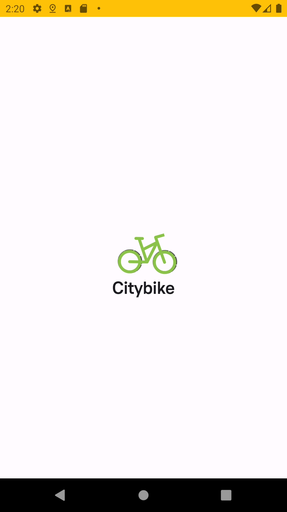
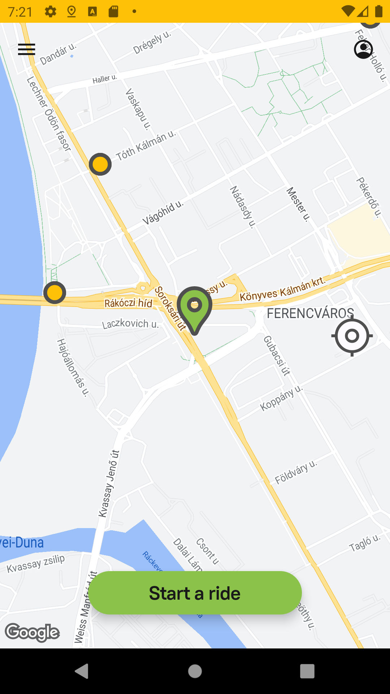
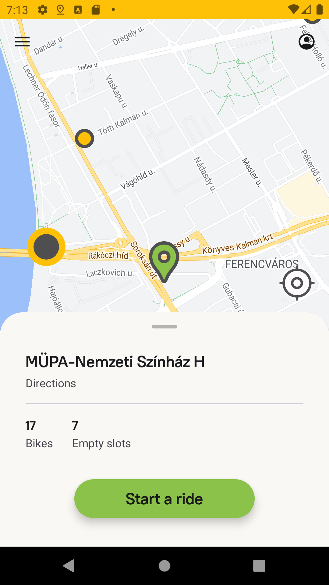
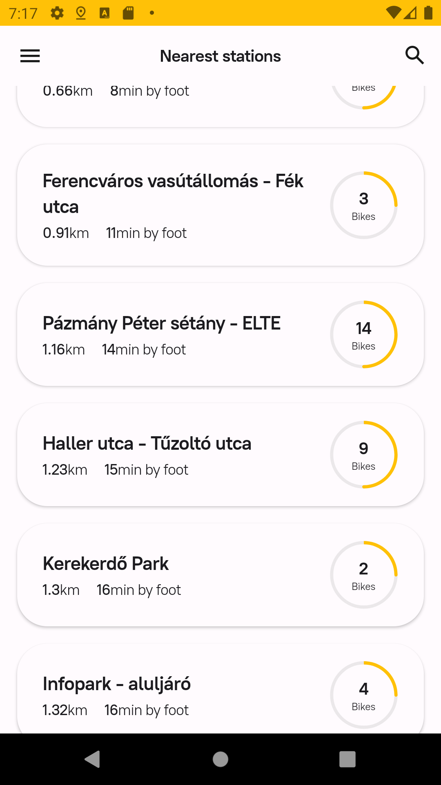
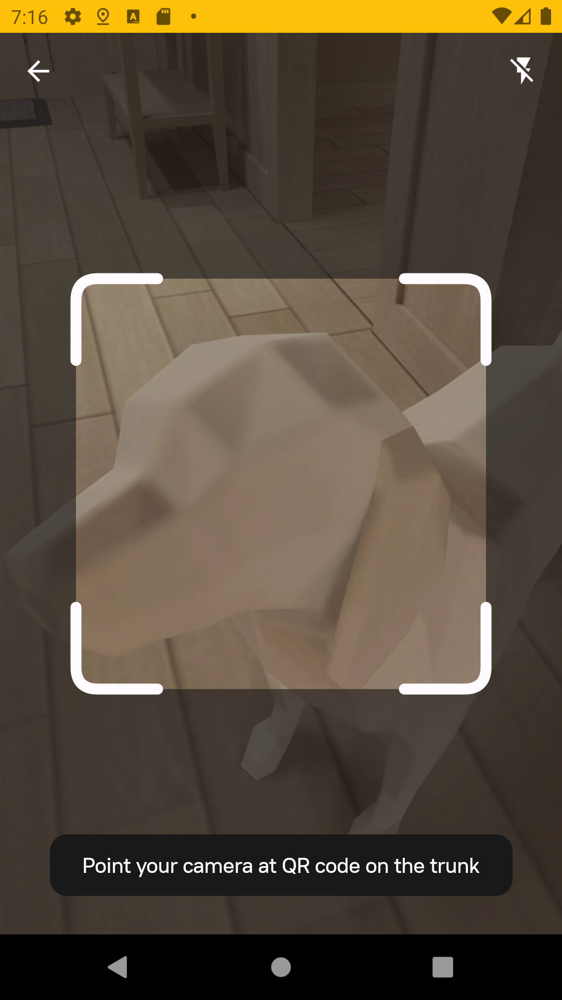

# Project Title

City bike

## Overview

City bike is an app to view the bike rental stations in Budapest, Hungary, you view their data (free bikes, empty slots, location). App calculates the distance between your location and all the stations and an approximate time to reach them. Also, this app uses QR code scanner to emulate booking a bike via scanning code on it. 

The app is consists of four screens:

* Loading animation with bicycle animated drawable and Motion Layout
* Map screen with custom "My location" markers, "My location button" and all markers. Clicking on marker station allows you to see bottom sheet with information. Clicking "Start a ride" will navigate you to QR-code scanner 
* Nearest stations screen shows the stations data in form of a list in a RecyclerView.
* QR-code scanner screen allows to scan a QR-code. After detecting and decoding it navigates to Map screen.

### Screenshots

## Used APIs

City bike REST API used to get data about stations.
Google maps API used for map screen.

## License
